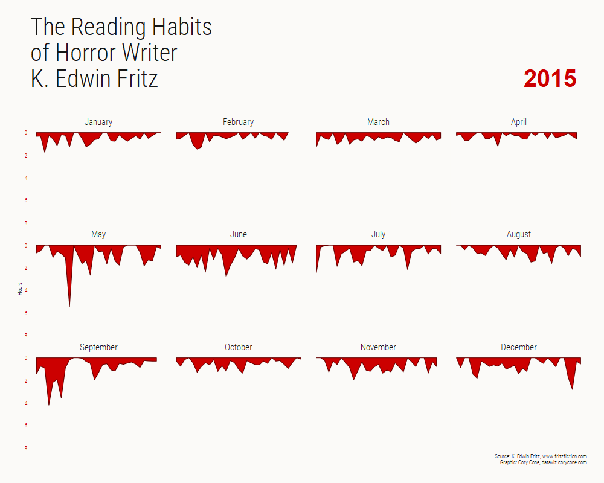

# The Reading Habits of Horror Writer K. Edwin Fritz

fritz_reading.R -- This script generates the stacked plot chart of all four years of K. Edwin Fritz reading data

all_years_animation.R -- This scripts generates the animated chart that transition between all years.

deconstruction_plots.R -- This script produced the abstract/experimental plots related to this data. (in progress)

fritz_reading_prep.R -- This script is called from the other scripts for various data prep/repeatable code.

books.R code for ggplotly graphs. 
[2018](https://plot.ly/~ccone/1/#/), [2017](https://plot.ly/~ccone/3/#/), [2016](https://plot.ly/~ccone/5/#/), [2015](https://plot.ly/~ccone/7/#/), though these don't look very good on mobile.

font is Roboto Condensed, https://fonts.google.com/specimen/Roboto+Condensed
# Animated

# Static Image

